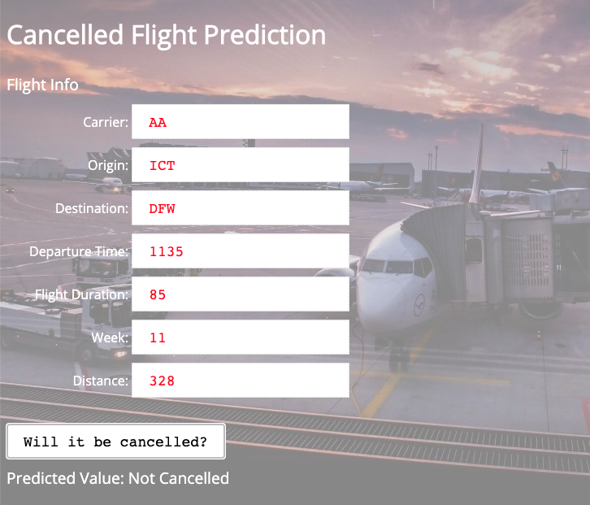

# Machine Learning at Scale
Flight analytics and cancellation prediction with pyspark and sparklyr

This project is for the end-to-end ML at Scale workshop. It creates an API that can 
predict the likelihood of a flight being cancelled based on historic flight data. 
The original dataset comes from [Kaggle](https://www.kaggle.com/yuanyuwendymu/airline-delay-and-cancellation-data-2009-2018). 
The project shows both the pyspark and sparklyr implementations and covers:

+ Importing Data 
+ Data Science and Exploration
+ Data Engineering
+ ML Model Building and Optimisation
+ ML Model Training
+ ML Model Serving
+ Deploying an Application

## Setup Required

Make sure to run the `0_bootstrap.py` to set up the project at the start.